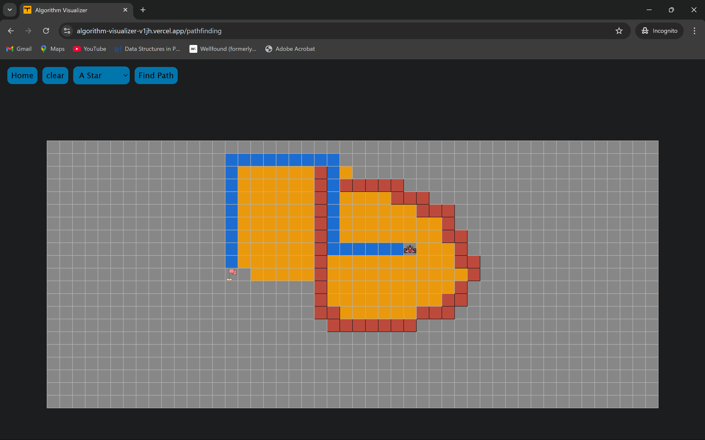
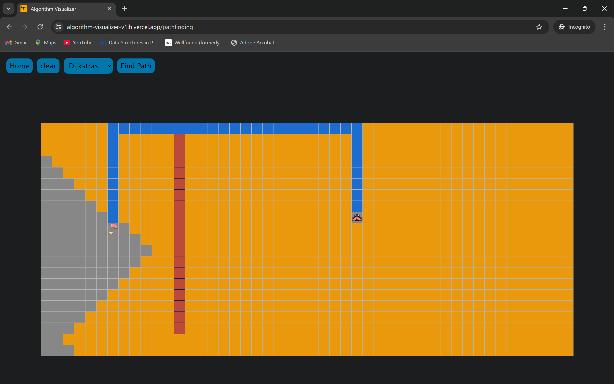
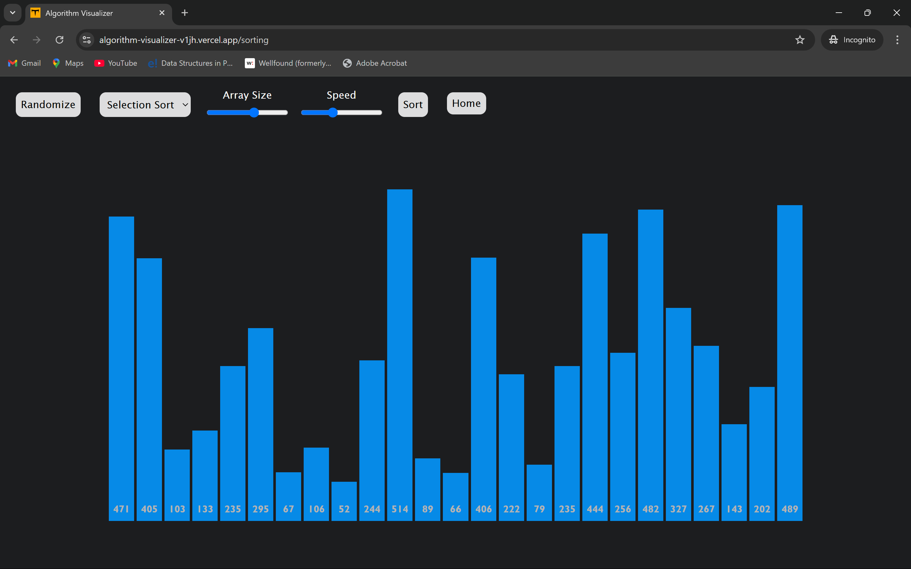
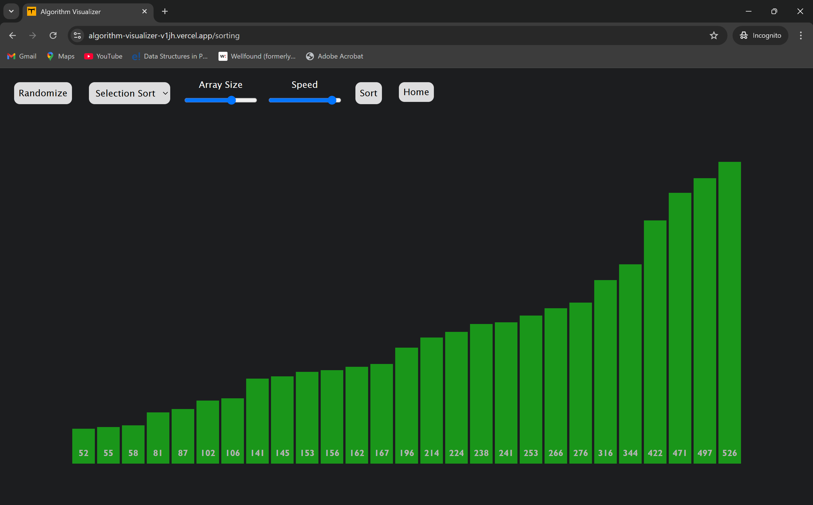

# Algorithm Visualizer 🎯

[Visit Algorithm Visualizer](https://algorithm-visualizer-v1jh.vercel.app/)

## 🚀 Introduction
Algorithm Visualizer is an interactive React-based web application designed to help users understand and visualize both pathfinding and sorting algorithms.

## ✨ Features
- Visualization of Pathfinding Algorithms
  + Includes popular algorithms like Dijkstra's Algorithm and A Search*
- Visualization of Sorting Algorithms
  - Observe step-by-step sorting with algorithms like Selection Sort
- Interactive Grid (Pathfinding)
  - Create obstacles, set start and end points, and watch the algorithm in action
- Dynamic Array (Sorting)
  - Visualize the sorting process on customizable arrays
- User-Friendly Interface
  - Intuitive design for a seamless experience

## 📚 Algorithms Implemented
#### Path Finding
- Dijkstra's Algorithm
- A Star
#### Sorting
- Selection Sort
## 🧩 How to Use
#### Pathfinding
- OPen the [live demo](https://algorithm-visualizer-v1jh.vercel.app/)
- Set a Start Point and End Point on the grid
- Draw obstacles by clicking and dragging on the grid
- Select a pathfinding algorithm from the dropdown menu
- Click the Find path button to see the algorithm in action

#### Sorting
- Navigate to the Sorting Visualizer section
- Change the size of the array with array size toggle
- Adjust the speed of the process with speed toggle
- Randomize the array with randomize button
- Select a sorting algorithm from the dropdown menu (For now selection sort only)
- click the Sort button to watch the sorting process step-by-step

## 🚀 Getting Started (For Developers)
To run projects locally
- Clone the repository
```bash
git clone https://github.com/tintino7/Algorithm-Visualizer.git
cd algorithm_visualizer
```
- Install dependencies
```bash
npm install
```
- Start the development server
```bash
npm run dev
```
## 📸 Screenshots
#### A star

#### Dijkstra's

#### Selection Sort

#### Sorted



